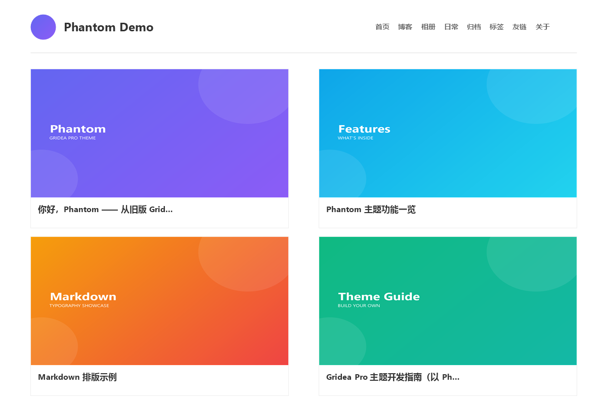

# Phantom

> 一个 Gridea Pro 主题 · 由旧版 Gridea 主题 [`gridea-theme-phantom`](https://github.com/wherelse/gridea-theme-phantom) 转制
> 引擎：Jinja2 (Pongo2)



磁贴式首页 + 顶部平铺导航，保留 HTML5UP Phantom 的设计气质；同时把友链、闪念、评论等
交给 Gridea Pro 的原生能力，配置更省心。

## 特性

- **磁贴式首页 / 博客列表**，自动分页，封面统一比例
- **文章页**：正文 + 右侧浮动目录（窄屏自动隐藏）
- **全套页面**：归档、标签、分类、相册、闪念、友链、关于、404
- **贴齐 Gridea Pro 原生能力**：友链 `links`、闪念 `memos`、站点级评论（Twikoo / Waline / Valine / Gitalk / Giscus / Disqus / Cusdis）
- **整齐不抖动**：标题固定 2 行、摘要固定 3 行截断；悬停只做 `transform` 缩放
- **无封面自动封面**：未设置特色图的文章自动生成柔和渐变封面，可在主题设置中关闭
- 社交图标墙、备案信息、自定义 CSS、代码高亮开关

## 安装

1. 把本目录复制到你的 Gridea Pro 站点目录的 `themes/` 下
   （默认站点目录 `~/Documents/Gridea Pro/`）。
2. 重启 Gridea Pro，在「主题」中切换到 **Phantom**。

> 主题 `config.json` 的 `customConfig` 声明有进程级缓存：安装后若改动声明或默认值，
> 需重启应用才生效；改动 `templates/`、`assets/` 无需重启。

## 主题设置

设置面板分组：**社交**、**主题功能**、**相册**、**友链**、**日常/memos**、**评论**。
每一项的详细用途见下方使用指南。

## 在线演示

- **Demo 站点**：<https://wherelse.github.io/gridea-pro-theme-phantom-demo/>
- **Demo 源码**：<https://github.com/wherelse/gridea-pro-theme-phantom-demo>

## 使用指南

完整的安装、设置详解、页面来源、特殊页面机制、自定义方法与常见问题：

- 在线：<https://wherelse.github.io/gridea-pro-theme-phantom-demo/post/theme-guide/>
- 源文件：演示站仓库的 `posts/theme-guide.md`

## 目录结构

```
gridea-pro-theme-phantom/
├── config.json              # 主题元信息 + 可视化配置声明
├── README.md
├── LICENSE
├── assets/
│   ├── media/               # 图标、脚本、字体、preview.png 预览图
│   └── styles/
│       ├── main.less        # 主样式（构建为 /styles/main.css）
│       └── components/      # post / friends / gallery / memos 子样式
└── templates/
    ├── base.html
    ├── index.html / blog.html / post.html
    ├── archives.html / tag.html / tags.html
    ├── category.html / categories.html
    ├── links.html / memos.html / gallery.html / about.html / 404.html
    └── partials/            # head / header / footer / post-list / pagination / comments
```

## 说明

- 博客列表页由引擎渲染到 `/{postPath}/`（默认 `/post/`），**不是** `/blog/`。
- 「关于」与「相册」通过文件名等于模板名（`about` / `gallery`）的文章触发。
- 评论平台在站点级「评论」设置中配置，主题自动适配。

## 致谢

- 设计来源：[HTML5UP Phantom](https://html5up.net/phantom)
- 工具链：[Gridea Pro](https://github.com/Gridea-Pro/gridea-pro) 与 [theme-builder-skill](https://github.com/Gridea-Pro/theme-builder-skill)

## 授权

[MIT](LICENSE) © 2026 wherelse
